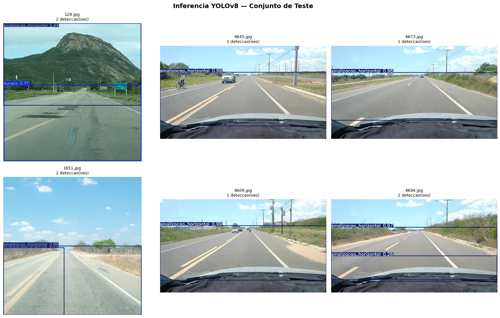

# pavimentos-brasil-icm

Deteccao automatica de defeitos em pavimentos rodoviarios com YOLOv8 e calculo do Indice de Condicao de Manutencao (ICM) segundo a metodologia do DNIT. O projeto utiliza o dataset Pavimentos-Brasil, composto por aproximadamente 9.000 imagens de rodovias dos estados do Ceara e Piaui, coletadas via smartphone.

---

## Sobre o Projeto

O Indice de Condicao de Manutencao (ICM) e utilizado pelo Departamento Nacional de Infraestrutura de Transportes (DNIT) para medir a qualidade e seguranca das rodovias brasileiras. Sua apuracao tradicional depende de inspetorias manuais, processo custoso e demorado.

Este projeto implementa um pipeline de visao computacional capaz de:

- Classificar o tipo de defeito presente em uma imagem de pavimento
- Localizar e delimitar cada defeito com bounding boxes
- Calcular o score ICM automaticamente a partir da area relativa dos defeitos detectados

O repositorio contem dois notebooks independentes e complementares: um para classificacao de imagens com EfficientNetB0 e outro para deteccao de objetos com YOLOv8.

## Classes de Defeitos

| Classe | Peso ICM |
|---|---|
| buraco | 5 |
| trinca | 3 |
| remendo | 2 |
| drenagem | 2 |
| sinalizacao_vertical | 1 |
| sinalizacao_horizontal | 1 |
| vegetacao | 1 |

Os pesos refletem o impacto de cada tipo de defeito na condicao de rodagem. O score ICM e calculado pela formula:

```
ICM = 100 - soma(peso_classe * area_relativa_defeito)
```

Faixas de classificacao: Otimo (>=80), Bom (60-79), Regular (40-59), Ruim (20-39), Pessimo (<20).

---

## Notebook 1: Classificacao com EfficientNetB0

Classifica a imagem inteira em uma das sete categorias de defeito. Indicado para triagem rapida de grandes volumes de imagens.

**Pipeline:**

1. Download do dataset via Kaggle API
2. Analise exploratoria (distribuicao de classes, dimensoes, desbalanceamento)
3. Pre-processamento com data augmentation (flip, rotacao, jitter de brilho e contraste)
4. Transfer learning com EfficientNetB0 pre-treinado no ImageNet
5. Fine-tuning parcial das duas ultimas camadas do backbone
6. Avaliacao com classification report, matriz de confusao e curva ROC multiclasse
7. Grad-CAM para visualizacao das regioes de ativacao por classe
8. Exportacao do modelo em `.pt` e TorchScript

**Resultados de referencia:**

| Metrica | Valor |
|---|---|
| Acuracia | depende do dataset anotado |
| F1 Macro | depende do dataset anotado |
| Formato de exportacao | `.pt`, TorchScript |

---

## Notebook 2: Deteccao de Objetos com YOLOv8

Localiza cada defeito individualmente com bounding boxes, permitindo calcular a area afetada por tipo de defeito e derivar o score ICM por imagem.

**Pipeline:**

1. Download das imagens via Kaggle API
2. Geracao de pseudo-labels automaticos com Grounding DINO (opcional, para datasets sem anotacao manual)
3. Download de dataset anotado via Roboflow (opcional, recomendado)
4. Criacao da estrutura de pastas YOLO e do arquivo `data.yaml`
5. Split estratificado 70/15/15 com verificacao visual das anotacoes
6. Treinamento com YOLOv8n, mosaic, mixup, copy-paste e early stopping
7. Avaliacao com mAP@50, mAP@50-95, precision, recall e AP por classe
8. Calculo do ICM por imagem a partir das deteccoes
9. Exportacao para ONNX e metadados em JSON

**Resultados obtidos (baseline com 107 imagens anotadas):**

| Metrica | Valor |
|---|---|
| mAP@0.50 | 0.672 |
| mAP@0.50:0.95 | 0.584 |
| Precision | 0.923 |
| Recall | 0.589 |
| Epocas efetivas | 41 (early stopping) |
| ICM medio do trecho | 30 (Pessimo) |



Para uma analise detalhada dos resultados, limitacoes e recomendacoes, consulte o [estudo de caso](docs/estudo_de_caso_pavimentos_yolov8.md).

---

## Requisitos

Os notebooks foram desenvolvidos para Google Colab com GPU T4. As dependencias sao instaladas automaticamente na primeira celula de cada notebook.

Dependencias principais:

```
ultralytics
torch
torchvision
roboflow
supervision
groundingdino-py
scikit-learn
timm
grad-cam
```

## Como Usar

**1. Abrir no Google Colab**

Acesse o notebook desejado e clique em "Open in Colab".

**2. Configurar credenciais**

- Kaggle: faca upload do seu `kaggle.json` quando solicitado na celula de setup. O token pode ser gerado em kaggle.com > Account > API > Create New Token.
- Roboflow (opcional, para o notebook YOLOv8): preencha `ROBOFLOW_API_KEY`, `ROBOFLOW_WS` e `ROBOFLOW_PROJECT` na celula de configuracoes globais.

**3. Selecionar runtime com GPU**

No  Google Colab: Runtime > Change runtime type > T4 GPU.

**4. Executar as celulas em ordem**

Todas as celulas estao organizadas sequencialmente. Nao e necessario nenhuma modificacao de codigo para o fluxo padrao.

---

## Dataset

**Pavimentos-Brasil**
Autor: Mateus Serafim
Disponivel em: https://www.kaggle.com/datasets/mateusserafim/pavimentosbrasil
Licenca: ver pagina do dataset no Kaggle
Conteudo: aproximadamente 9.000 imagens JPEG de rodovias do Ceara e Piaui, organizadas por categoria de defeito.

---

## Limitacoes Conhecidas

O baseline foi treinado com 107 imagens anotadas, o que e insuficiente para cobrir todas as sete classes com robustez. No experimento atual, apenas duas classes (buraco e sinalizacao_horizontal) produziram deteccoes. Para uso em producao, recomenda-se um minimo de 200 imagens anotadas por classe.

O calculo do ICM implementado e uma aproximacao simplificada da metodologia DNIT. Os pesos por classe e as faixas de classificacao devem ser calibrados com base na tabela oficial do orgao para uso em contexto regulatorio.


## Referencia

Se utilizar este projeto em pesquisa ou trabalho academico, cite o dataset original:

```
Serafim, M. Pavimentos-Brasil. Kaggle, 2022.
https://www.kaggle.com/datasets/mateusserafim/pavimentosbrasil
```
